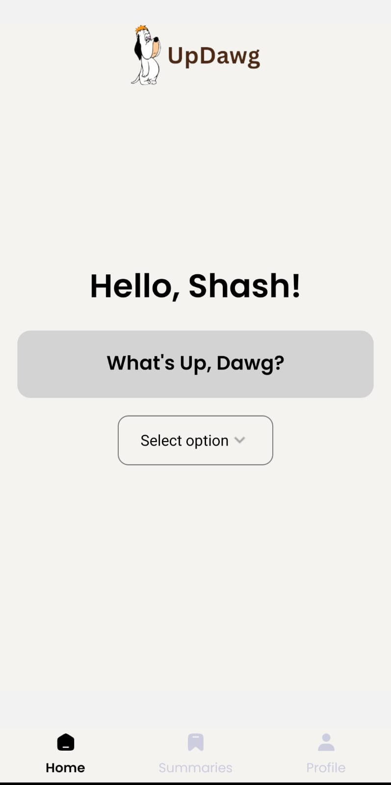
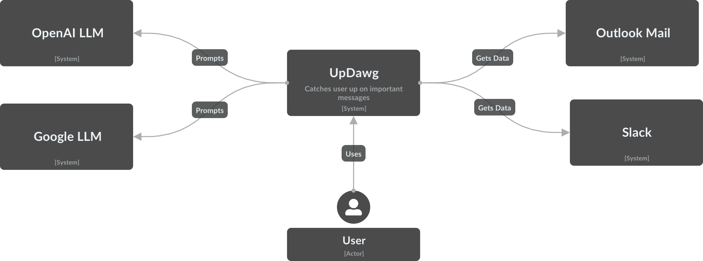
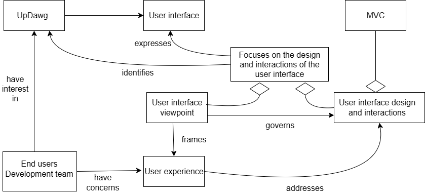
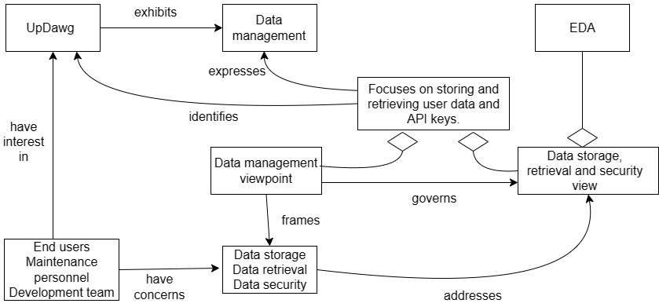
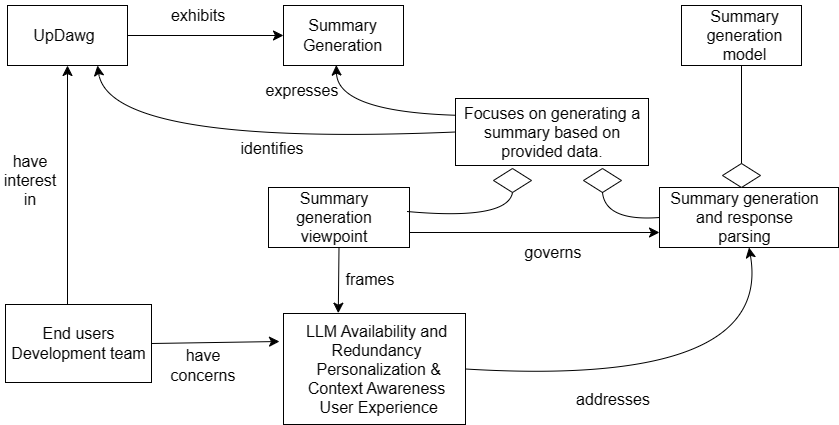
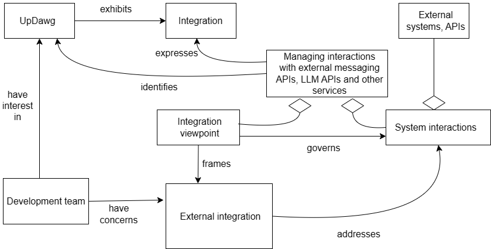
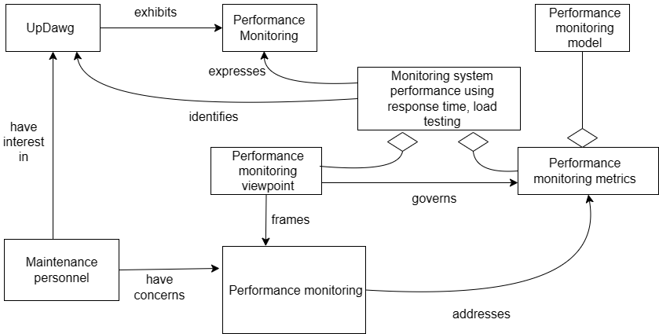
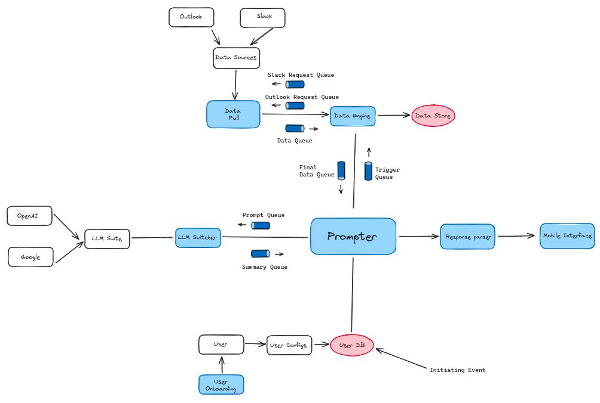

# Software Engineering | Project 3 | Team 15

[Github](https://github.com/aryanchandramania/UpDawg)

# Task 1 : Requirements and Subsystems

## Functional Requirements

1. **User Registration and Authentication:**
    - Users should be able to register with a unique username and password.
    - Authentication mechanisms should ensure secure access to the system.
2. **Token Management:**
    - Users should be able to provide tokens for LLM models and other applications securely.
3. **Integration with Messaging/Social Media Platforms:**
    - The system should integrate with various messaging platforms like **Outlook Mail**, **Slack**, etc.
    - It should be capable of retrieving messages and other relevant data from these platforms.
4. **Message Storage:**
    - Store user messages securely and efficiently.
    - Allow users to specify time frames for message storage.
5. **Summary Generation:**
    - Utilize APIs of LLM models to generate **summaries** of user messages.
    - Identify important messages or topics based on the generated summaries.
7. **User Preferences:**
    - Allow users to customize summary generation parameters.
8. **Security and Privacy:**
    - Implement encryption mechanisms to ensure data security.
    - Comply with privacy regulations and ensure user data privacy.
9. **User Interface:**
    - Provide an intuitive user interface for interaction with the system.
    - Support multiple devices and screen sizes.
10. **Logging and Auditing:**
    - Log user activities and system events for auditing and troubleshooting purposes.
11. **Error Handling:**
    - Implement robust error-handling mechanisms to handle failures gracefully.
    - Provide informative error messages for users.

## Non Functional Requirements

1. **Performance:**
    - Maintain a response time of less than 6 seconds
    - Ensure optimal system responsiveness, especially during peak usage periods, by optimizing message retrieval and processing.
    - Implement efficient mechanisms for message storage and retrieval to maintain high-performance levels.
    - Periodically pull and store messages from various email and messaging services to facilitate rapid summary generation without the need for real-time data retrieval.
2. **Scalability:**
    - Design the system to seamlessly accommodate a growing user base and increase message volumes.
    - Design the system to enable us to add more messaging services and LLM services in the future.
    - Implement scalable storage solutions to support the expansion of user data without compromising system performance.
3. **Modifiability:**
    - Aim to enhance the system's ability to accommodate future changes and additions by allowing easy integration of new components and services.
    - Provide flexibility in selecting Language Model Models (LLMs) and pulling message data from multiple sources, facilitating system scalability and adaptability.
4. **Availability:**
    - Aim to ensure continuous availability of system services by minimizing system downtime through redundancy and failover mechanisms.
    - Prioritize the selection of reliable Language Model Models (LLMs) to enhance system availability and mitigate potential disruptions.
5. **Reliability:**
    - Minimize system downtime through the implementation of redundancy and failover mechanisms, ensuring continuous availability of services.
    - Ensure high system availability by proactively addressing potential points of failure and implementing robust error-handling processes.
    - Prioritize the selection of Language Model Models (LLMs) based on their reliability to enhance system availability.
6. **Security:**
    - Employ robust encryption techniques for secure data transmission and storage, safeguarding user information and message content.
    - Hash user passwords and encrypt user tokens to prevent unauthorized access to sensitive system resources.
    - Ensure that message data is handled exclusively by the DB Engine in the Data Retrieval subsystem, minimizing exposure to other subsystems.
7. **Compatibility:**
    - Ensure compatibility with a diverse range of devices and operating systems to facilitate seamless access to system functionalities across different platforms.
    - Support integration with various messaging and social media APIs, enabling interoperability with external services.
8. **Usability:**
    - Aim to enhance user experience by designing an intuitive and user-friendly interface with clear instructions and guidance.
    - Simplify user interaction with the system, making it easy for users to connect their messaging apps and generate message summaries.
9. **Maintainability:**
    - Structure the system codebase to facilitate ease of maintenance and future updates, ensuring scalability and adaptability.
    - Document the code and system architecture comprehensively to aid in understanding and troubleshooting potential issues.
10. **Resource Utilization:**
    - Optimize system resource usage to minimize overhead and ensure efficient utilization of memory and CPU resources.
    - Implement efficient memory management and processing techniques to enhance system performance and responsiveness.
11. **Interoperability:**
    - Ensure seamless integration with third-party services and APIs to enable interoperability and data exchange between different systems.
    
    ## C4 Diagramming and Subsystems
    
    ### C1: **System Context Diagram**
    
    
    
    ### 1. UpDawg System
    
    The UpDawg system serves as the central hub for aggregating user data and messages from external email and messaging services. Users entrust this system with their credentials and preferences, specifying time intervals for data retrieval. Using these inputs, UpDawg ingests the messages from various platforms. Once collected, the system employs the APIs of preferred Language Model Models (LLMs), like OpenAI ChatGPT and Google Gemini, to return comprehensive summaries from the accumulated data. These summaries are then dispatched to the frontend for immediate access and also stored in a dedicated database, maintaining a compact repository of the latest 10 summaries per user.
    
    ### 2. External LLM Services
    
    The LLM Subsystem houses several Language Model services, such as OpenAI ChatGPT and Google Gemini. These external services stand ready to process data fed from UpDawg, leveraging their APIs to distil summaries from the user messages.
    
    ### 3. E-Mail and Messaging Services
    
    The Messaging Subsystem interfaces with external email and messaging platforms, like Outlook Mail and Slack. Users grant explicit access to these platforms, enabling the flow of messages within the designated time frames. Leveraging their APIs, the Messaging Subsystem retrieves, aggregates, and dispatches messages, ensuring a cohesive and integrated user experience across diverse communication channels.
    
    ### User
    
    The primary stakeholder, the User, interacts directly with the UpDawg Subsystem. Users provide their credentials and configuration parameters, deciding the duration of data retrieval and the model used for summarization.
    
    ### C2: **Container Diagram**
    
    _(1).png)
    
    ### Mobile Interface Container
    
    The Mobile Interface provides users with a platform for interacting with the system. It facilitates efficient navigation and access to system functionalities. The interface is consistent and useable across diverse mobile devices.
    
    ### 1.1. User Management Subsystem
    
    The User Management module oversees the administrative aspects of user accounts within the system. It is responsible for tasks such as registration, authentication, storing credentials for other services, including tokens for LLM services, and managing the user database. It ensures the system functions concurrently for multiple users logged in simultaneously.
    
    ### User Database Container
    
    The User Database stores the username, hashed password, email ID, Slack email and ID, and encrypted tokens of Users.
    
    ### 1.2. Prompter Subsystem
    
    The Prompter module receives user messages from the Data Retrieval module and then communicates with external Language Model Models (LLMs) using the Summarization module to generate message summaries. It interacts with the Mobile Interface to obtain prompts and with the User Management module to retrieve user preferences and tokens. Leveraging user-provided tokens and preferences, it initiates requests to designated LLMs and coordinates the retrieval of summarized data. It then sends the summaries to the Response Parser subsystem.
    
    ### 1.3. Response Parser Subsystem
    
    The Response Parser module processes and refines the summaries generated by the LLMs, as received from the Prompter module. Its primary function involves parsing the raw summary data and applying necessary formatting and cleansing operations to ensure coherence and readability. The refined summaries are dispatched to the User Interface. Additionally, the Response Parser module stores the processed summaries in a dedicated database called **SummaryDB** which is also a container. The module ensures the most recent 10 summaries for each user.
    
    ### **C3: Component Diagram**
    
    
    
    1.4. Summarization subsystem consists of: 1.4.1. LLM Switcher **Component**
    
    ### 1.4. Summarization Subsystem
    
    The Summarization subsystem receives user messages along with prompts from the Prompter module. Within the Summarization subsystem, a component known as the LLM Switcher [1.4.1] selects the appropriate Language Model Model (LLM) based on user preferences obtained from the Prompter module. Subsequently, the selected LLM generates the message summary, which is then returned to the Prompter module for further processing.
    
    
    
    1.5. Data Retrieval subsystem consists of: 1.5.1. **Data Pull Component** and 1.5.2. **DB Engine Component**
    
    ### 1.5. Data Retrieval Subsystem
    
    The Data Retrieval subsystem is responsible for fetching data from Outlook Mail and Slack, utilizing the user credentials provided by the Prompter module. Additionally, the Prompter module communicates user preferences regarding the desired duration of message collection (e.g., 1 day, 2 days, 1 week). Based on these preferences, the Data Retrieval subsystem retrieves messages within the specified timeframe from the designated email and messaging services. Once collected, the messages are transmitted back to the Prompter module for further processing.
    
    Within the Data Retrieval subsystem, the Data Pull module [1.5.1] is responsible for the extraction of data from external sources. It pulls user messages and stores them in a dedicated message database through the DB Engine. Subsequently, the DB Engine module [1.5.2] within the subsystem retrieves the required messages based on the specified period. Once retrieved, these messages are transmitted back to the Prompter module for further processing.
    
    # Task 2 : Architecture Framework
    
    ## Stakeholders
    
    1. **End Users** - expects a smooth and enjoyable experience while using the platform, and the updates provided by the platform keep him/her informed and organized, thereby increasing productivity.
    2. **System Architects** - concerned with designing and maintaining the platform's architecture, ensuring scalability, reliability, and adherence to best practices.
    3. **Development Team** - responsible for implementation of the platform’s features and ensuring platform functionality.
    4. **Maintenance Personnel** - ensures ongoing maintenance, updates, and support for the platform, keeping it running smoothly and securely. 
    
    ## Concerns
    
    1. **User experience -** provide an easy-to-use experience for the users, with smooth onboarding, a clean interface for the platform, and informative updates and summaries.
        - Stakeholders - end users, development team
    2. **Secure data storage and retrieval** - Collecting sensitive user data necessary for platform usage, while also protecting users’ privacy.
        - Stakeholders - end users, maintenance personnel, development team
    3. **Security and reliability -** Ensuring the platform is secure, stable, and resilient, including measures such as encryption for security, and backups for reliability. 
        - Stakeholders - end users, maintenance personnel
    4. **Availability -** The Assistant should be able to reliably function even when some of the background LLM services face downtime.
        - Stakeholders - End user, maintenance personnel
    5. **External integration -** Ability of the platform to seamlessly integrate and interact with external services, such as messaging platforms and LLM APIs.
        - Stakeholders **-** Development team 
    6. **Modular architecture -** Ensure that the platform is designed with a modular architecture to make it more extensible, allowing for the addition of newer sources for message consolidation. 
        - Stakeholders - Development team, system architects
    7. **Performance monitoring -** Monitoring the platform's performance and quality of service, including metrics such as response time and error rates.
        - Stakeholders - Maintenance personnel
    8. **LLM Availability and Redundancy** - Ensuring the availability of LLMs and having redundancy in place to switch to alternative models in case of downtime or issues with any particular model.
        - Stakeholders - Development Team
    9. **Compliance with standards -** Adhering to architectural standards and best practices.
        - Stakeholders - system architects, development team
    10. **Personalization and Context Awareness -** Providing personalized responses tailored to individual users' information, and ensuring the platform is context-aware to offer relevant responses.
        - Stakeholders - end users, development team
    11. **Innovation and Adaptability -** Continuously innovating to integrate new features, improve existing functionalities, and adapt to technological advancements
        - Stakeholders - maintenance personnel, development team
    
    ## Architecture viewpoints
    
    1. **User interface Viewpoint**
        1. **Concerns** - User experience
        2. **View description -** describes the UpDawg user interface with its components and interaction patterns.
        3. **Stakeholders -** End users, development team
        
        
        
    2. **Data Management Viewpoint**
        1. **Concerns** - Secure data storage and retrieval
        2. **View description -** illustrates how user data and API keys are securely stored and managed.
        3. **Stakeholders -** End users, maintenance personnel, development team
        
        
        
    3. **Summary Generation Viewpoint**
        1. **Concerns** - LLM Availability and Redundancy, Personalization and Context Awareness, User Experience
        2. **View description -** illustrates how a summary is generated by the platform based on the data and prompt provided.
        3. **Stakeholders -** End users, development team
        
        
        
    4. **Integration Viewpoint**
        1. **Concerns** - External integration
        2. **View description -** Describes how UpDawg interacts with external platform APIs, LLM APIs and other services.
        3. **Stakeholders -** Development team
        
        
        
    5. **Performance Monitoring Viewpoint**
        1. **Concerns** - Performance monitoring
        2. **View description -** illustrates monitoring of performance in the UpDawg system using load testing, response times and more.
        3. **Stakeholders -** Maintenance personnel
        
        
        
        ## Architectural Design Records
        
        ## ADR 1 : Using Monolithic Architecture over Microservices and other approaches
        
        ### Context
        
        The platform requires an architectural approach that can effectively handle functionalities such as user management, data retrieval, summarization, and integration with multiple messaging platforms. Factors like scalability, maintainability, performance, and ease of development need to be considered.
        
        ### Decision
        
        We chose a monolithic architecture over microservices due to the platform's straightforward requirements and our project's current scale. Microservices, with their added complexity, seemed unnecessary for our needs. The monolithic approach offers simplicity in development, deployment, and maintenance, aligning well with our project's scope. It enables swift iterations and updates without the complexities of inter-service communication. Considering performance as a priority, we anticipate better performance with a monolithic setup, avoiding the overhead of service communication and potential network latency. Additionally, our limited expertise and time constraints made microservices adoption less feasible, potentially leading to complications.
        
        ### Consequences
        
        **Advantages:**
        
        1. **Simplified Development and Maintenance**: Opting for a monolithic architecture streamlines the development and maintenance processes, simplifying code management. 
        2. **Enhanced Performance and Efficiency**: Monolithic architectures possibly exhibits better performance , due to reduced communication overhead between components compared to distributed microservices architectures. Suitable for our simpler system with fewer components, where the benefits of microservices may not outweigh the added complexity.
        3. **Simplified Security Management**: Consolidating security measures within a monolithic architecture simplifies security management by centralizing authentication, access control, and data protection mechanisms.
        4. **Easier Integration and Interoperability**: Integrating third-party services and APIs becomes easier in a monolithic architecture as all components share the same runtime environment and dependencies. This was important in our system, considering we had to work with multiple different APIs.
        
        **Disadvantages:**
        
        1. **Limited Scalability**: Scaling individual components or subsystems independently becomes challenging. As the platform grows, scaling the entire monolithic application may become inefficient, leading to over-provisioning of resources or underutilization of certain functionalities.
        2. **Increased Risk of Single Point of Failure**: Since all components of the platform reside within the same codebase and runtime environment, a failure in one part of the system can potentially affect the entire application.
        
        ## ADR 2: Going with MySQL over MongoDB or other services
        
        ### Context
        
        Our platform runs on our own local server, with minimal external dependencies as required. The database would store messages and emails pertaining to our users. The confidentiality of such kinds of data is crucial to addressing the users’ privacy concerns. We also need to make sure that the system is secure and reliable. Availability is also desired, albeit this can be mitigated by employing a cache of sorts on our side. We would also like to have control over the database and have it be easy to monitor.
        
        ### Decision
        
        We decided to go with a MySQL instance running on our own server. Other options we considered were MongoDB, local files in `.txt` or `.json` formats, and a distributed database system. We rejected each of these for multiple reasons — `.txt` and `.json` are too simplistic for our needs and would require a lot of acrobatics in terms of parsing and pushing data; a distributed database is simply too much overhead for what is intended to be a simple, minimalist system and for which scalability is not the primary concern; MongoDB — being an external database — suffers from a host of issues, including security, performance, API availability, etc.
        
        ### Consequences
        
        **Advantages:**
        
        1. **Availability:** A local MySQL server will always be available unless the app server itself goes down, at which point we would have bigger issues to deal with. This is in contrast to an external DB or one that you need to communicate with over the internet.
        2. **Security:** Since the data is being stored locally, it’s very secure and doesn’t need to be transmitted or stored anywhere else and is thus not vulnerable to security leaks in external providers.
        3. **Maintainability:** It would be much easier to maintain a single database than a distributed one, which would raise issues such as redundancy, replication, etc.
        4. **Performance:** This receives a major boost due to the fact that data CRUD operations are extremely fast when compared to any other method.
        
        **Disadvantages:**
        
        1. **Single Point of Failure:** One database going down means the entire DB being unavailable, but as discussed, we would have bigger issues in that case.
        2. **Limited Scalability:** A single database is not scalable and in the event that the app gains a huge amount of users, we would start facing problems with performance.
        
        ## ADR 3: AdaLLM (Adaptively choosing the LLM API provider)
        
        ### Context
        
        Our service takes the user’s latest messages/mails and prompts an LLM API to perform a translation action on them (usually a summarization). For this, we would like the APIs to be performant as well as available, since we believe their quality to be comparable. 
        
        ### Decision
        
        We decided to go with an algorithm that pulls the latest statistics on issues and downtimes for each of the APIs, and based on that chooses which one to go with. This has been decided over choosing one at random or trying to somehow estimate their quality, or by setting up a local LLM instance.
        
        ### Consequences
        
        **Advantages:**
        
        1. **Availability:** The point of this exercise is to improve availability by picking the one that’s least likely to have gone down.
        2. **Usability:** Improves user experience by avoiding the wait for a response and then a subsequent re-request to another API or by asking them to go through the entire process of setting up an LLM locally.
        3. **Scalability:** This would really help when extending our system to a large scale, because waiting for response which may not come would prove detrimental to our performance.
        
        **Disadvantages:**
        
        1. **Performance:** Performance takes a slight hit because we have to compare and select which API service to go with.
        
        # Task 3: Architectural Tactics and Patterns
        
        ## Architectural Tactics
        
        ### Security
        
        In our system, security is paramount. Within the User Management subsystem, we employ robust encryption techniques to safeguard user tokens, ensuring they remain secure during transmission and storage. Additionally, user passwords are hashed, adding an extra layer of protection against unauthorized access. Furthermore, in the Data Retrieval subsystem, access to message data is restricted solely to the DB Engine module, mitigating the risk of data exposure to other subsystems.
        
        - The DB Engine employs the Security tactic of Limiting Exposure by restricting access to sensitive data, reducing the risk of unauthorized access.
            - Security Tactic → Resisting Attacks → Limit Exposure
        - Hashed passwords implemented within the system adhere to the Security tactic of Authenticating Users, enhancing user authentication mechanisms.
            - Security Tactic → Resisting Attacks → Authenticate Users
        - Encrypted token keys ensure data confidentiality, exemplifying the Security tactic of Maintaining Data Confidentiality and resilience against potential breaches.
            - Security Tactic → Resisting Attacks → Maintain Data Confidentiality
        
        ### Performance
        
        Our system prioritizes performance to deliver swift and efficient operation. The Data Pull module periodically retrieves messages from various email and messaging services, storing them with timestamps for efficient retrieval. When generating message summaries, only the messages within the specified time duration must be processed, reducing the computational overhead. This approach optimizes performance, ensuring rapid response times for users seeking summaries.
        
        - The Data Pull module optimizes performance by adhering to the Performance tactic of Reducing Computation Overhead, streamlining data retrieval processes and enhancing system efficiency.
            - Performance Tactic → Resource Demand → Reduce Computation Overhead
        
        ### Modifiability
        
        We've designed our system with modifiability in mind, allowing for easy integration of additional components and services. The LLM Switcher module enables users to choose between multiple Language Model Models (LLMs), enhancing flexibility. Moreover, the system architecture is built on a flexible design pattern, facilitating seamless integration of new APIs and services. The Data Pull module is similarly designed to accommodate the addition of more email and messaging services, ensuring scalability and adaptability.
        
        - Both the LLM Switcher and Data Pull modules exemplify the Modifiability tactic of Localizing Changes by encapsulating functionality within modules, facilitating easier modification and maintenance.
            - Modifiability Tactic → Localize Changes → Genaralize Module
        - Additionally, the Modifiability tactic of Preventing Ripple Effects is demonstrated through the use of intermediaries within these modules, minimizing the impact of changes on other system components.
            - Modifiability Tactic → Prevent Ripple Effects → Use an Intermediary
        
        ### Availability
        
        Ensuring system availability is a key priority. We periodically store all user messages in the Message DB, an SQL database, guaranteeing data availability. Additionally, the Summary DB, attached to the Response Parser subsystem, maintains a JSON file storing the last 10 summaries of each user, further enhancing accessibility. To mitigate potential delays and issues in external systems, we prioritize LLMs based on their reliability, selecting the most available option by default unless specified otherwise by the user.
        
        - The Data Pull module implements the Availability tactic of Fault Prevention by periodically retrieving and storing messages, ensuring continuous availability of data even in the event of potential failures.
            - Availability Tactic → Fault Prevention → Removal
        - Similarly, the Response Parser subsystem exemplifies the Availability tactic of Fault Prevention, enhancing system reliability and uptime.
            - Availability Tactic → Fault Prevention
        
        ### Usability
        
        Usability is central to our system's design philosophy. We've crafted an intuitive and visually appealing user interface (UI) with a focus on user experience (UX). This design makes it effortless for users to connect their messaging apps to our system and generate message summaries for their selected time frames. By prioritizing usability, we ensure a seamless and enjoyable experience for all users, regardless of their technical proficiency.
        
        - The UI/UX design of the Mobile Interface embodies the Usability tactic of Design Time, prioritizing intuitive user interaction and enhancing overall user experience.
            - Usability Tactic → Design Time
        
        ## Architectural Implementation Patterns
        
        ## Monolithic Architecture
        
        ### Description
        
        In the monolithic architecture, the entire system is implemented as a single, self-contained unit. When a user initiates a request from the frontend, specifying the desired period for summary generation, the request is received by the central application server. The application server orchestrates the entire flow of data retrieval, processing, and summary generation.
        
        The application server triggers the Slack and Outlook Data Pullers to retrieve the relevant data for the requested period. These pullers run periodically, retrieving data at pre-defined intervals and storing it in a centralized data store (MySQL).
        
        Once the data is available, the application server constructs a prompt based on the user's request and sends it to the LLM Switcher component. The LLM Switcher evaluates the available APl services and selects the most appropriate one for generating the summary.
        
        The selected Language Model service generates the summary, which is then processed by the Response Parser component within the application server. The Response Parser formats the summary and sends it back to the frontend for display to the user.
        
        ### Design Elements
        
        1. **Frontend**: The user interface where requests for summary generation are initiated.
        2. **Application Server**: The central component that orchestrates the entire flow of data retrieval, processing, and summary generation. It includes the following sub-components:
            - Request Handler: Receives and processes user requests from the frontend.
            - Prompter: Constructs prompts based on the user's request and sends them to the LLM Switcher.
            - Response Parser: Receives generated summaries, formats them, and sends them back to the frontend.
        3. **Data Pullers**:
            - Slack Data Puller: Retrieves data from Slack at pre-defined intervals and stores it in the data store.
            - Outlook Data Puller: Retrieves data from Outlook at pre-defined intervals and stores it in the data store.
        4. **Data Store**: A centralized database or storage system that holds the retrieved data from the Data Pullers.
        5. **LLM Switcher**: Evaluates the available Language Model services, and selects the most appropriate one for generating summaries based on the received prompts.
        6. **Language Model Services**: External services or APIs that generate summaries based on the provided prompts.
        
        ### Advantages
        
        1. **Simplicity**: Monolithic architectures are generally simpler to develop, deploy, and maintain compared to distributed systems.
        2. **Tight Integration**: All components are tightly coupled and can communicate directly with each other, reducing the need for complex communication mechanisms.
        3. **Performance**: With periodic data retrieval and summary generation, the system can respond to user requests more efficiently, as the data and summaries are readily available.
        4. **Ease of Debugging**: Debugging and troubleshooting issues in a monolithic system are generally more straightforward than in distributed systems.
        
        ### Disadvantages
        
        1. **Scalability**: Scaling a monolithic application can be challenging, as the entire application must be scaled as a single unit, leading to potential resource inefficiencies.
        2. **Single Point of Failure**: If the application server fails, the entire system becomes unavailable.
    
    ## Event Driven Architecture
    
    For comparison with our implemented monolithic architecture, we have implemented an event driven architecture. 
    
    
    
    ### Description
    
    When a user initiates a request from the frontend, specifying the desired period for summary generation, this request triggers a series of events. The Prompter component receives the request and publishes it to the Data Engine, which dispatches the request to the respective Slack and Outlook Data Pullers. These pullers retrieve the relevant data and publish it back to the Data Engine, which accumulates the data and forwards it to the Prompter. The Prompter then constructs a prompt and sends it to the LLM Switcher, which selects the appropriate Language Model service to generate a summary. The generated summary is routed back to the Prompter and subsequently to the Response Parser, where it is formatted and delivered to the frontend for display to the user. 
    
    Here we have independent events which asynchronously emit and receive events over event buses/queue. Each components just publishes and receives data from the queues without knowing where it has come from. Hence there is heavy decoupling between the components. We have used **RabbitMQ** for the queues implementation.
    
    Unlike our monolithic implementation, here the data pullers only pull on receiving a user request and do not run periodically. The LLM switcher too only chooses the best LLM on demand. This impacts its performance in comparison.
    
    ### Design Elements
    
    1. **Initiating Event**: The initiating event in this system is the user request sent from the frontend. This event triggers the entire process of retrieving, summarizing, and displaying the requested 
    data.
    2. **Event Producers**:
        - Frontend: Initiates the user request event.
        - Slack and Outlook Data Pullers: These components listen for requests on their respective request queues, generating events when new requests are detected.
        - Data Engine: Acts as an event producer when it receives data from the pullers and publishes it to data queues for further processing.
        - LLM Switcher: Produces events when it receives prompts from the prompter, selects the appropriate language model, and generates a summary.
    3. **Event Consumers**:
        - Prompter: Consumes events from the frontend, data engine, and LLM switcher. It processes requests, constructs prompts, and sends them to the appropriate components.
        - Data Engine: Consumes events from the pullers and produces events for the prompter and LLM switcher.
        - LLM Switcher: Consumes prompts from the prompter and produces events for the selected language model to generate summaries.
        - Response Parser: Consumes events from the LLM switcher and constructs suitable responses for the frontend.
    4. **Event Bus/Queues**:
        - Trigger Queue : User request is sent from the prompter to the data engine
        - Request Queues: Used by Slack and Outlook data pullers to listen for user requests.
        - Data Queues: Data pulled by the data pullers are sent back on these queues to the data engine.
        - Prompt Queue: Used by the prompter to send prompts to the LLM switcher.
        - Summary Queue: Used by the LLM switcher to send generated summaries to the prompter.
    
    ### Advantages
    
    1. **Decoupled Components**: The event-driven architecture promotes loose coupling between components, allowing them to operate independently and communicate asynchronously through events and queues.
    2. **Scalability**: Individual components can be scaled independently based on the load and demand, ensuring efficient resource utilization and high availability. Allows for us horizontal scaling. 
    3. **Fault Tolerance**: If one component fails, it does not impact the entire system, as other components can continue to operate and process events from their respective queues.
    4. **Asynchronous Processing**: Events are processed asynchronously, allowing the system to handle multiple requests concurrently and improve overall responsiveness.
    
    ### Disadvantages
    
    1. **Performance and Availability:** Performance impact due to the on-demand nature of certain components like the Data Pullers and LLM Switcher. Unlike our monolithic implementation where data retrieval and summarization processes run periodically, these components in the event-driven architecture operate only when triggered by user requests, which can introduce delays and higher latency in processing and responding to user requests,
    2. **Complexity**: Managing and monitoring the flow of events and queues across multiple components can become complex, especially as the system grows in scale.
    3. **Debugging**: Troubleshooting and debugging event-driven systems can be challenging due to the distributed nature of event processing.